# Upskill System Architecture & Flow Charts

## System Overview

The upskill system is a role-based RAG (Retrieval-Augmented Generation) platform that enables managers to upload knowledge documents and operators to query them for troubleshooting assistance.

---

## High-Level System Architecture

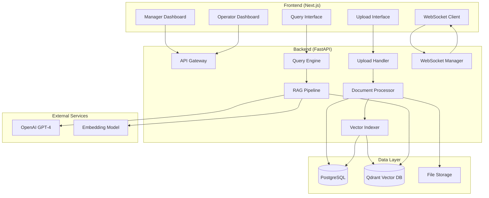

---

## Detailed Component Architecture

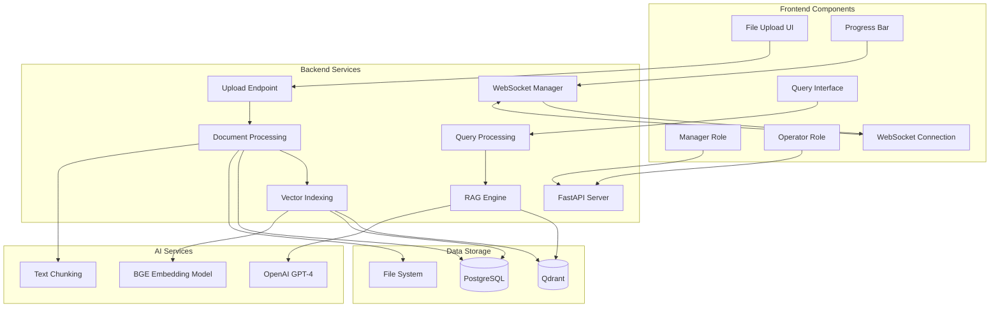

---

## File Upload to Knowledge Creation Flow

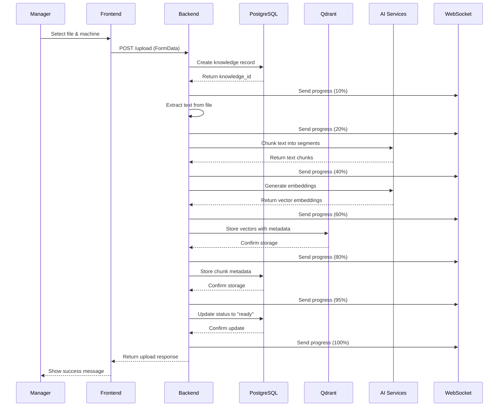

---

## Document Processing Pipeline

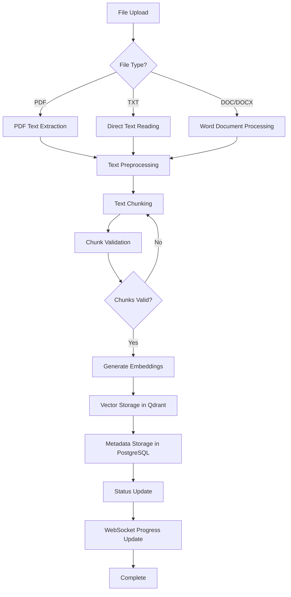

---

## Query Processing Flow

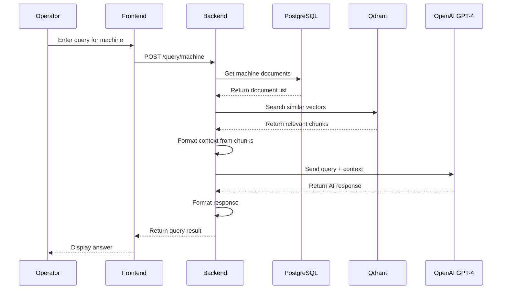

---

## WebSocket Progress Update Flow

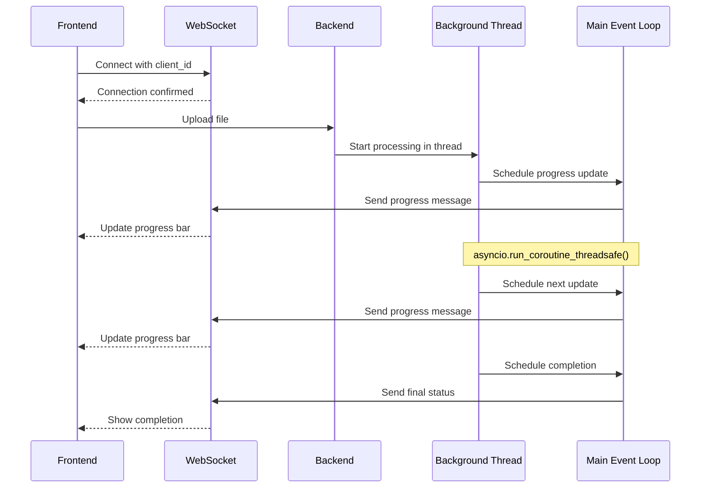

---

## Data Flow Architecture

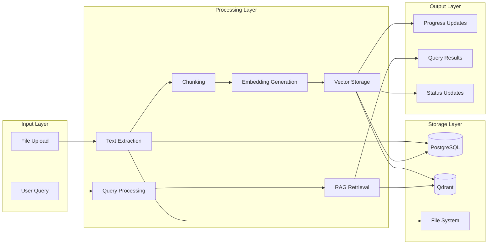

---

## Database Schema & Relationships

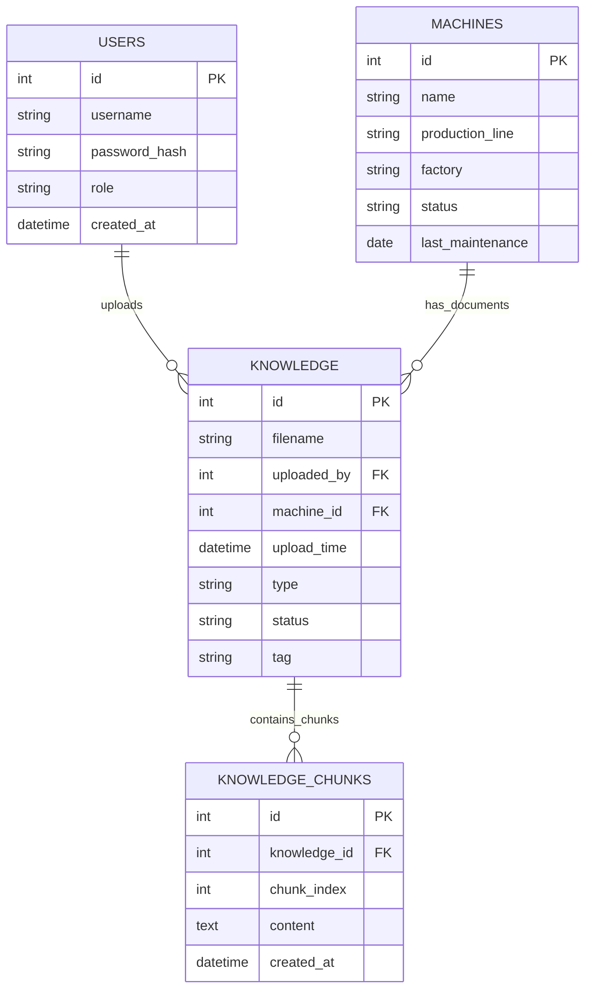

---

## Vector Storage Architecture

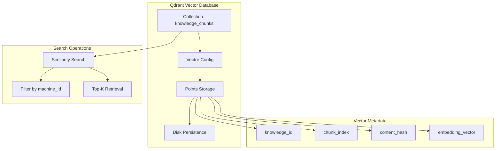

---

## Error Handling & Recovery Flow

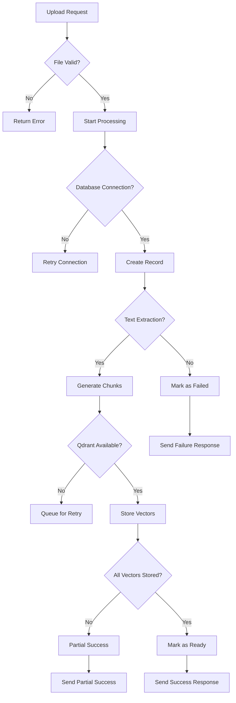

---

## Performance Optimization Points

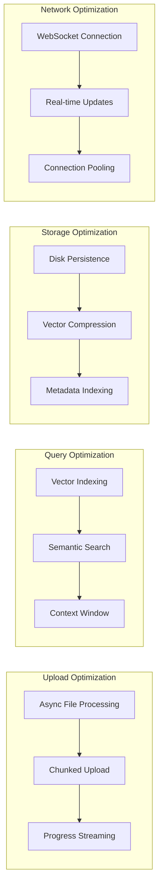

---

## Security & Access Control

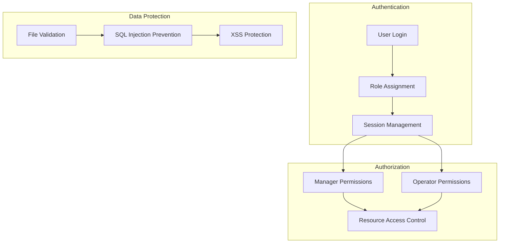

---

## Monitoring & Logging Architecture

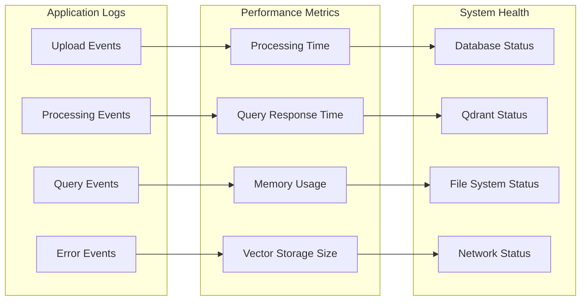

---

## Deployment Architecture

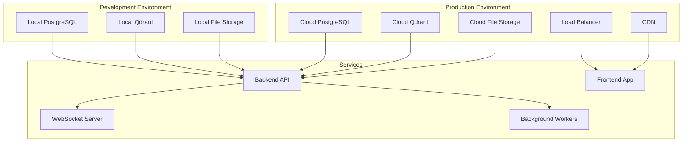

---

## Key Technical Specifications

### File Processing Pipeline
- **Supported Formats**: PDF, TXT, DOC, DOCX
- **Text Extraction**: PyMuPDF, pdfplumber
- **Chunking Strategy**: Semantic chunking with overlap
- **Chunk Size**: Configurable (default: 1000 characters)
- **Overlap**: 200 characters between chunks

### Vector Storage
- **Embedding Model**: BGE-large-en-v1.5
- **Vector Dimension**: 1024
- **Distance Metric**: Cosine similarity
- **Persistence**: Disk-based with `on_disk: true`
- **Collection**: `knowledge_chunks`

### Query Processing
- **Search Strategy**: Semantic similarity + metadata filtering
- **Context Window**: Top 5 most relevant chunks
- **AI Model**: OpenAI GPT-4-turbo
- **Response Format**: Structured with confidence scores

### Real-time Communication
- **Protocol**: WebSocket
- **Progress Updates**: 10% → 100% with status messages
- **Connection Management**: Thread-safe async operations
- **Client Tracking**: Per-client connection management

### Database Schema
- **Knowledge Records**: File metadata and processing status
- **Knowledge Chunks**: Text chunks with indexing metadata
- **Machine Association**: Documents linked to specific machines
- **User Tracking**: Upload history and permissions

---

## Recent System Improvements

### WebSocket Progress Updates
- **Issue**: "Client not connected to WebSocket" errors
- **Solution**: `asyncio.run_coroutine_threadsafe()` with main event loop
- **Result**: Reliable real-time progress updates

### Qdrant Vector Persistence
- **Issue**: Vector data loss on restart
- **Solution**: `on_disk: true` configuration
- **Result**: Persistent vector storage across restarts

### Database Operations
- **Issue**: Async SQLAlchemy operation errors
- **Solution**: Proper async/await syntax with `select()`
- **Result**: Reliable database operations

### Non-Destructive Collection Management
- **Issue**: Aggressive collection deletion
- **Solution**: Only create collections if they don't exist
- **Result**: Multiple uploads without data loss

---

This architecture ensures a robust, scalable, and maintainable system for knowledge management and RAG-based troubleshooting assistance. 